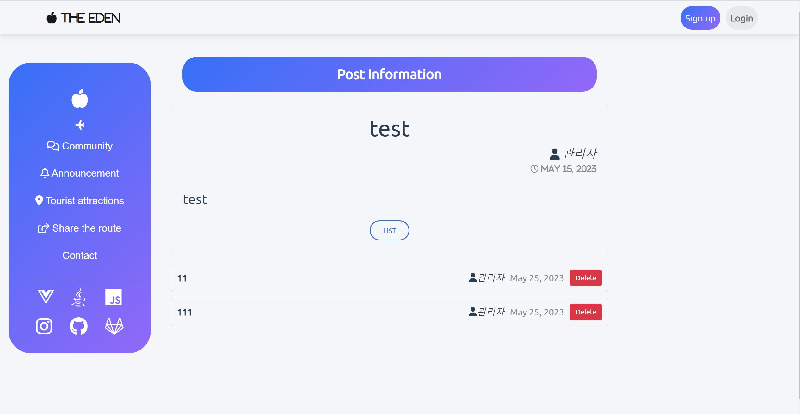
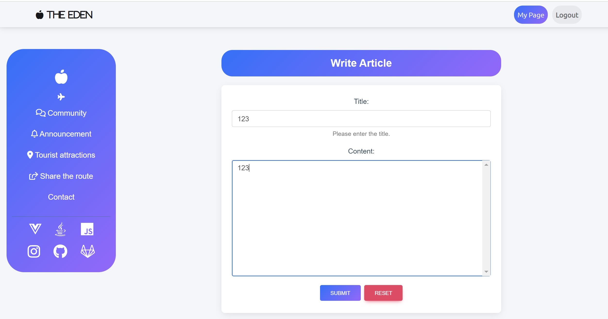
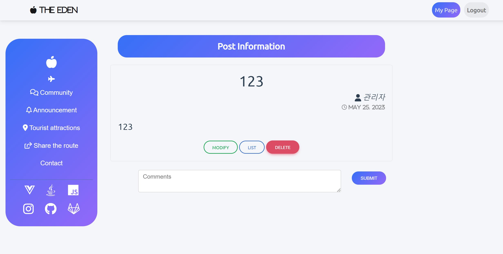
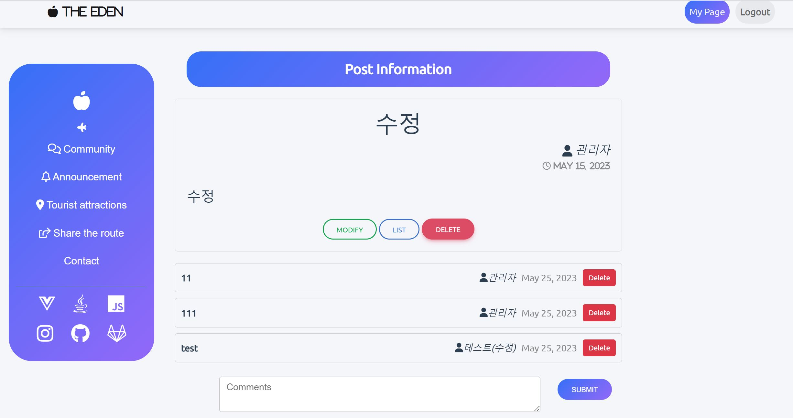
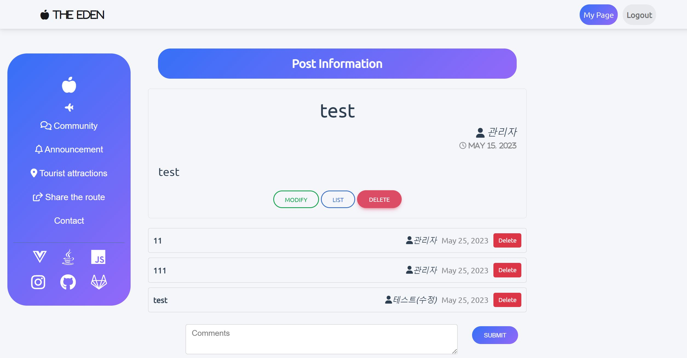

관통 프로젝트 제출 방법

# 관통프로젝트: TP_S09_S09_Vue_EnjoyTRip_김민섭_정우정
### 제출일: 2023.05.25

### 참여 페어
- 김민섭, 정우정

### 처리된 요구사항 목록

|난이도|구현기능|세부| 작성여부(O/X) |
|:---:|---|---|:---------:|
|기본|QnA 게시판 Vue.js를 적용한 웹페이지|게시글 목록|     O     |
|기본|QnA 게시판 Vue.js를 적용한 웹페이지|게시글 등록|     O     |
|기본|QnA 게시판 Vue.js를 적용한 웹페이지|게시글 수정|     O     |
|기본|QnA 게시판 Vue.js를 적용한 웹페이지|게시글 상세 검색|     O     |
|기본|서버측 구현|게시글 목록|     O     |
|기본|서버측 구현|게시글 등록|     O     |
|기본|서버측 구현|게시글 수정|     O     |
|기본|서버측 구현|게시글 삭제|     O     |
|기본|서버측 구현|게시글 상세 검색|     X     |
|추가|나마의 여행계획 페이지(팀별 아이디어)||     O     |
|추가|나만의 여행 계획 페이지(팀별 아이디어)||     O     |
|심화|HtoPLace 관련 페이지(팀별 아이디어)||     X     |

### 실행화면 캡쳐 -

ERD

구현 기능: 메인 페이지
로그인 되지 않은 경우 : 회원가입 버튼, 패스워드 초기화 버튼, 로그인 버튼 표시
로그인 된 경우 : 마이페이지 버튼, 로그아웃 버튼 표시

구현 기능: 게시판

구현 기능: 글 등록 - 이전

구현 기능: 글 등록 - 이후

구현 기능: 글 수정

구현 기능: 댓글

