관통 프로젝트 제출 방법

# 관통프로젝트: TP_S09_S09_Vue_EnjoyTRip_김민섭_정우정
### 제출일: 2023.05.25

### 참여 페어
- 김민섭, 정우정

### 처리된 요구사항 목록

|난이도|구현기능|세부| 작성여부(O/X) |
|:---:|---|---|:---------:|
|기본|QnA 게시판 Vue.js를 적용한 웹페이지|게시글 목록|     O     |
|기본|QnA 게시판 Vue.js를 적용한 웹페이지|게시글 등록|     O     |
|기본|QnA 게시판 Vue.js를 적용한 웹페이지|게시글 수정|     O     |
|기본|QnA 게시판 Vue.js를 적용한 웹페이지|게시글 상세 검색|     O     |
|기본|서버측 구현|게시글 목록|     O     |
|기본|서버측 구현|게시글 등록|     O     |
|기본|서버측 구현|게시글 수정|     O     |
|기본|서버측 구현|게시글 삭제|     O     |
|기본|서버측 구현|게시글 상세 검색|     O     |
|추가|나마의 여행계획 페이지(팀별 아이디어)||     O     |
|추가|나만의 여행 계획 페이지(팀별 아이디어)||     O     |
|심화|HtoPLace 관련 페이지(팀별 아이디어)||     X     |

### 실행화면 캡쳐 -

ERD
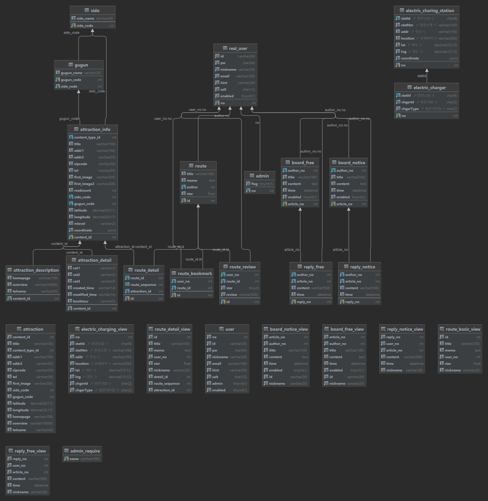

### 메인 페이지
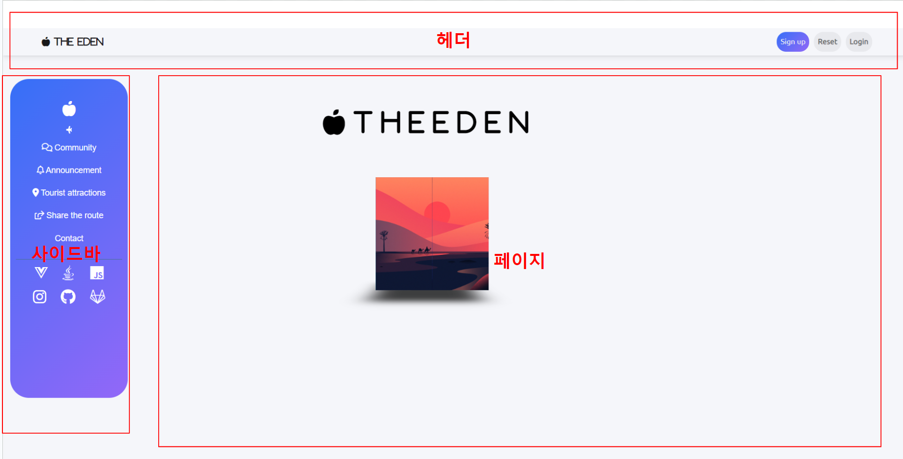
로그인 되지 않은 경우 : 회원가입 버튼, 패스워드 초기화 버튼, 로그인 버튼 표시
로그인 된 경우 : 마이페이지 버튼, 로그아웃 버튼 표시

### 회원가입 페이지
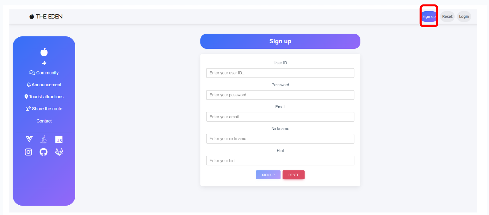
ID, Nickname 중복 확인, 중복된 값이 존재하지 않을 때만 Sign Up 버튼 활성화

### 패스워드 초기화 페이지
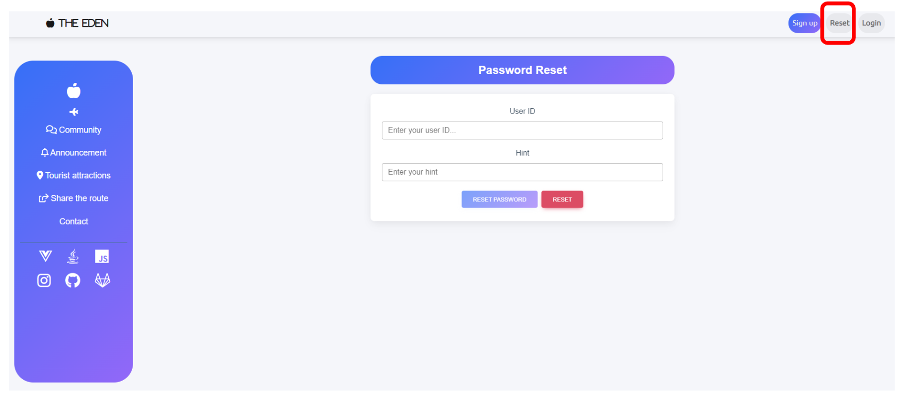
회원정보에 등록된 Hint와 일치하는 값을 넣은 경우, 등록된 이메일로 초기화 된 패스워드 전송

### 로그인 페이지
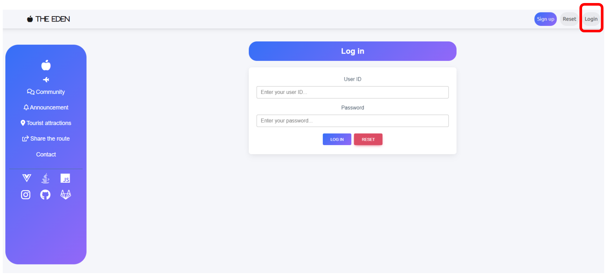
회원 정보에 저장된 패스워드와 일치하는 패스워드가 입력 된 경우 로그인 처리
(패스워드 해시 처리)

### 마이 페이지
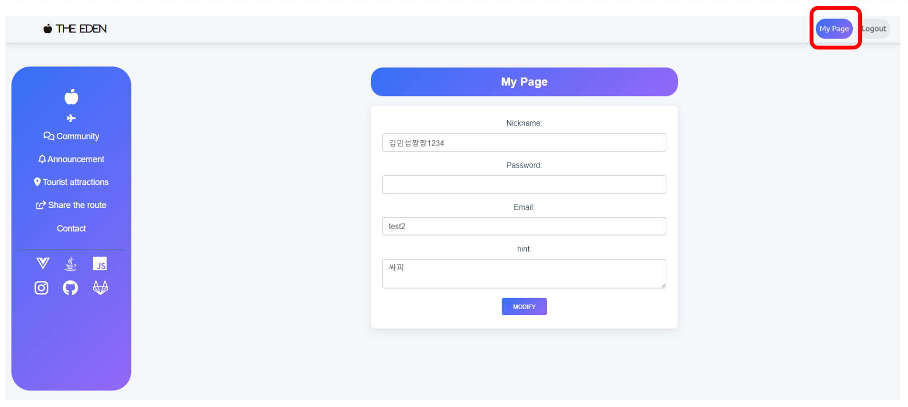
로그인 된 회원 정보 표시 및 정보 수정

### 게시판 페이지
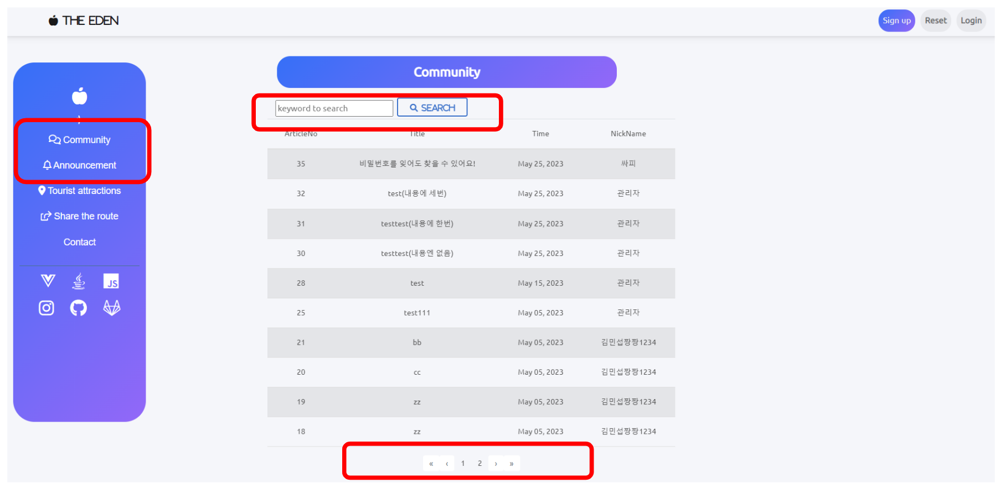
해당하는 게시판의 게시글을 페이징 처리
사용자가 입력한 키워드가 일치하는 순으로 검색 기능

### 게시글 페이지
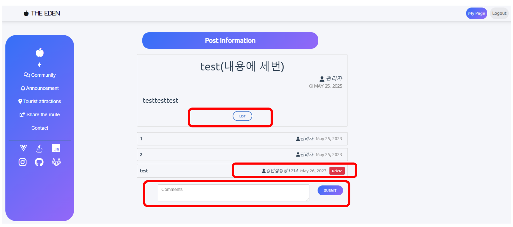
게시글/댓글 작성자와 일치하거나 관리자 계정인 경우만 수정/삭제 버튼 표시
로그인 된 경우에만 댓글 작성 칸 표시

### 관광지 페이지
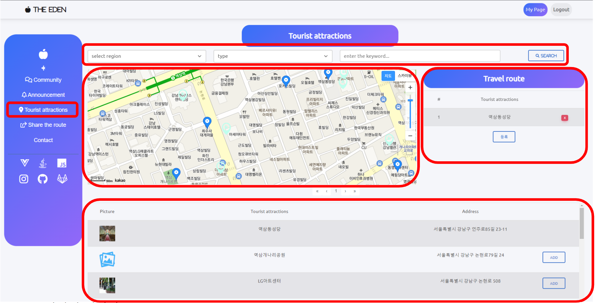
* 사용자가 검색하고자 하는 관광지를 검색할 수 있는 폼과, 해당 검색 결과를 나타낼 테이블
* 사용자가 추가한 관광지를 나타낼 테이블
* 검색/추가된 지점, 그리고 추가된 지점 주변의 전기차 충전소와 관광지를 나타낼 지도

### 경로 공유 페이지
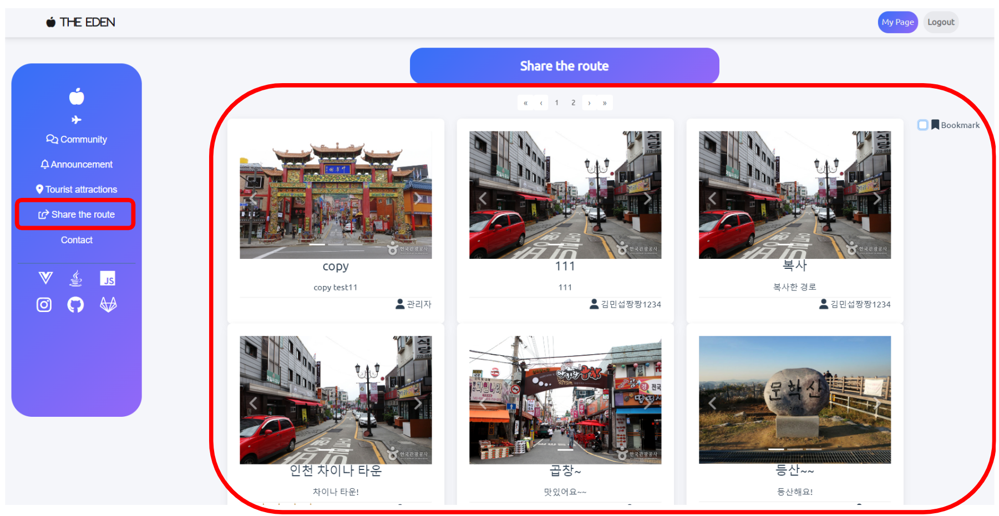
사용자가 등록한 관광 경로를 페이징하여 보여주는 페이지 
로그인 된 경우 즐겨찾기 한 경로를 따로 볼 수 있도록 구성

### 공유된 여행 경로를 나타내는 페이지
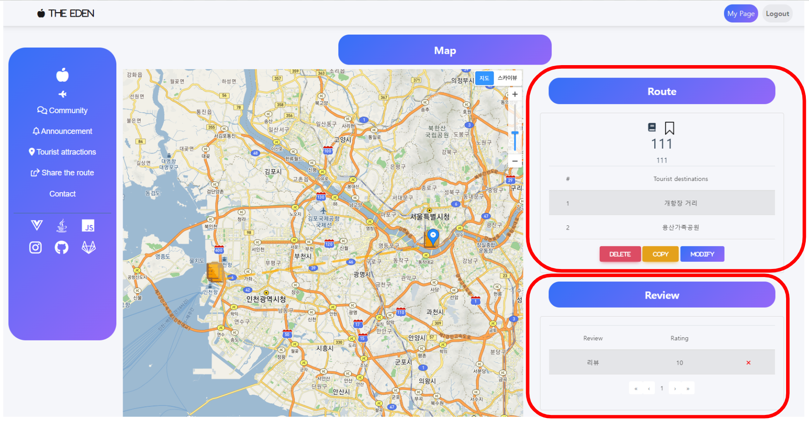
* 관리자이거나 본인의 경로인 경우에만 수정 삭제 버튼 표시 
* 로그인 된 경우 복사 버튼 표시 
* 로그인 된 경우 해당 경로에 리뷰를 달지 않은 경우 리뷰 작성 폼 작성한 경우 삭제할 수 있는 버튼 표시